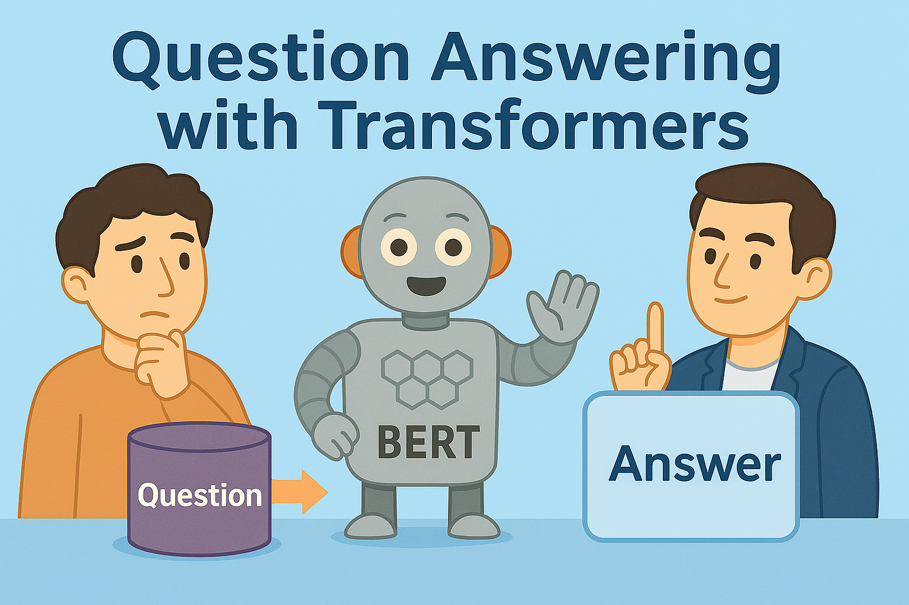

# 🔍 SQuAD - Question Answering System

A **Question Answering (QA)** application powered by a fine-tuned **DistilBERT** model trained on the **SQuAD dataset**.  
This project provides both:
- **Web interface** (via Streamlit) for interactive Q&A
- **Command-line interface** for quick testing

The system takes a **context paragraph** and a **question**, and returns the most likely answer span along with its position in the context and a confidence score.

---

## 🚀 Features

- **Fine-tuned DistilBERT** model on the [SQuAD dataset](https://rajpurkar.github.io/SQuAD-explorer/)
- Local **model & tokenizer loading** (no internet required after setup)
- **Fast inference** with PyTorch, GPU-accelerated if available
- **Accurate highlighting** of the predicted answer in the given context
- Confidence score calculation from model logits
- Clean and professional **Streamlit web UI**
- Modular project structure for easy maintenance

---

## 🛠️ Tech Stack

- **Python 3.9+**
- [Hugging Face Transformers](https://huggingface.co/docs/transformers/index)
- [PyTorch](https://pytorch.org/)
- [Streamlit](https://streamlit.io/)
- [Pydantic](https://docs.pydantic.dev/)
- [SQuAD Dataset](https://rajpurkar.github.io/SQuAD-explorer/)

---

## 📂 Project Structure

```
SQUAD-QA/
│
├── main.py                   # CLI & Web launcher
├── requirements.txt          # Python dependencies
├── README.md                 # Project documentation
│
└── src/
    ├── __init__.py
    ├── config.py              # Constants & model loading
    ├── inference.py           # Core QA inference logic
    ├── schemas.py             # Request/response data models
    │
    ├── assets/
    │   ├── qa_model/          # Extracted model files
    │   ├── qa_model_tokenizer/# Extracted tokenizer files
    │
    ├── notebook/
    │   └── SQUAD.ipynb       # Jupyter/Colab notebook
    │
    └── views/
        ├── __init__.py
        └── app.py             # Streamlit web app
        └── components
            └── answer_display.py
            └── header.py
            └── input_form.py
            └── sidebar.py
```

## 📦 Installation

1️⃣ **Clone the repository**
```bash
git clone https://github.com/your-username/squad-qa.git
cd squad-qa
```

2️⃣ **Create and activate a virtual environment**  
*(Recommended for clean dependency management)*
```bash
python -m venv venv
# Windows
venv\Scripts ctivate
# macOS/Linux
source venv/bin/activate
```

3️⃣ **Install dependencies**
```bash
pip install -r requirements.txt
```

4️⃣ **Add model & tokenizer files**  
- Place your **qa_model** and **qa_model_tokenizer** directories (or zips) in `src/assets/`.
- If zipped, the code will automatically unzip them on first run.

---

## ▶️ Running the Application

### **1. Web App (Streamlit)**
From the project root:
```bash
streamlit run src/views/app.py
```
Then open the link provided in your terminal (usually `http://localhost:8501`).

### **2. CLI Mode**
Run:
```bash
python main.py
```
You can also launch the web app via CLI:
```bash
python main.py --web
```

---

## 🖥️ Example Usage (CLI)

**Context:**
```
Hugging Face is a company that develops tools for building applications using machine learning.
```

**Question:**
```
What does Hugging Face develop?
```

**Output:**
```
Q: What does Hugging Face develop?
A: tools for building applications using machine learning
Confidence: 0.92
Start: 28
End: 84
```

---

## 🎯 Model Details

- **Base Model:** `distilbert-base-uncased`
- **Dataset:** SQuAD v1.1
- **Max sequence length:** 384 tokens
- **Document stride:** 128
- **Framework:** PyTorch
- **Special Tokens:** Standard DistilBERT tokenizer

---

## 🤝 Contributing

Contributions are welcome!  
If you’d like to:
- Improve the UI
- Enhance model performance
- Add multi-question batch inference
- Integrate with an API

Just fork the repo and submit a PR.

---

## 📜 License

This project is licensed under the MIT License — see the [LICENSE](LICENSE) file for details.

---

## 🙌 Acknowledgments

- [Hugging Face](https://huggingface.co/) for Transformers & Datasets
- [SQuAD Dataset](https://rajpurkar.github.io/SQuAD-explorer/) creators
- [Streamlit](https://streamlit.io/) for the simple web app framework
